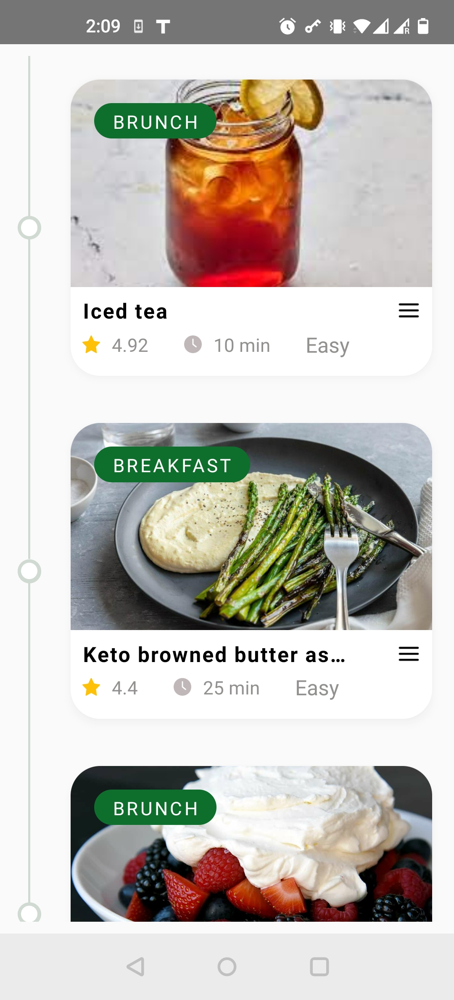
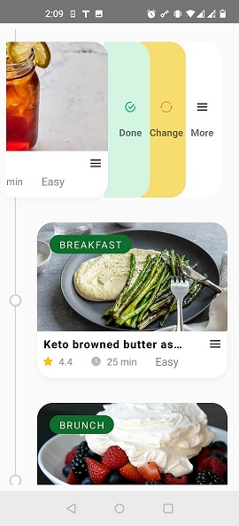

# Kostdoktorm

> **Note**: Make sure you have completed the [React Native - Environment Setup](https://reactnative.dev/docs/environment-setup) instructions till "Creating a new application" step, before proceeding.

# About

This app is created as a sample to show recipes list with few fields. 
This app also has code to run graphql APIs via Apollo but due to lack of required fields in the json data, sample modified data is used. 
This app is tested over android only due to resource limitations. 

# ScreenShots

## Step 1: Start the Metro Server

First, you will need to start **Metro**, the JavaScript _bundler_ that ships _with_ React Native.

# using npm

npm start

## Step 2: Start your Application

Let Metro Bundler run in its _own_ terminal. Open a _new_ terminal from the _root_ of your React Native project. Run the following command to start your _Android_ or _iOS_ app:

### For Android

# using npm

npm run android

If everything is set up _correctly_, you should see your new app running in your _Android Emulator_ or _iOS Simulator_ shortly provided you have set up your emulator/simulator correctly.

This is one way to run your app — you can also run it directly from within Android Studio and Xcode respectively.

# Tests

Unit tests can be found in **tests** folder 
e2e tests can be found in e2e folder 
e2e tests are written using detox and cucumber  

Please build the test package before running e2e tests 
Please replace the avd name from 'Pixel_7_API_33' inside .detoxrc.js to your system in the 
scripts are present in the package.json for building test apk for emulator and attached device 
scripts are present in the package.json for running e2e tests on emulator and attached device 
